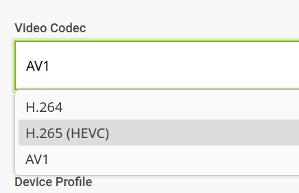
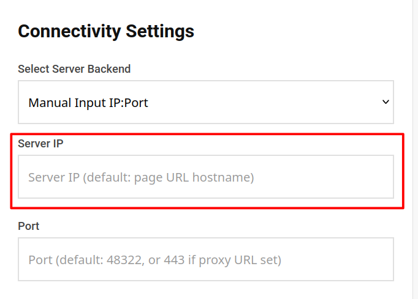
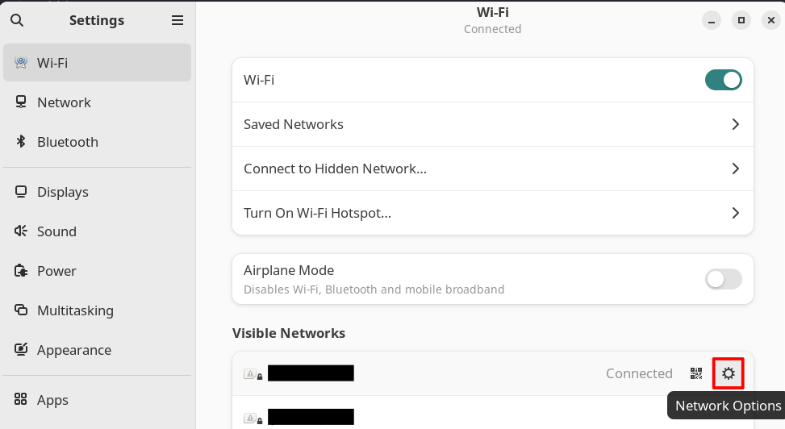
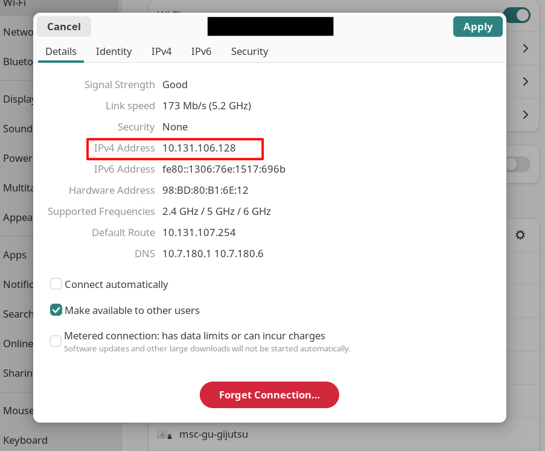

# Deploying the RLG G1 Neck

This guide assumes you have received the development kit, or have followed
the installation instructions to reach the point where the G1 Neck software
stack is installed on your system, and have wired everything together using
the wiring guide.

There are two sides to this: The PC (jetson) side and the headset side. You will
first need to bring up the PC stack, which will launch the CloudXR service.

Then, you can connect the headset to the PC through the CloudXR service
and get head tracking and a camera stream.

Before you start, **ensure your PC and headset are on the same network.**

## PC Bringup
1. Power your PC on and log in to the account containing the G1 Neck stack installation.
   In the case of the devkit, this is the `g1neck` account. Contact your provider for
   the account password if you do not have it.
2. (**Accuvision only**) We will need to apply a pitch correction of 13 degrees to the left camera. The exact value
   may vary depending on how you assembled your unit. You can conduct [camera alignment](#camera-alignment) during
   operation. **Until the decoder is able to save config data, this will need to be performed every time power is reconnected.**
   1. Connect a micro USB cable to left camera decoder's UART port.
   2. Open `gtkterm`. If it is not installed, install it via `sudo apt install gtkterm`
   3. Select the port connected to the decoder. This is usually `/dev/ttyUSB0`. Set the baudrate to 115200.
   4. Select pitch angle by pressing `p`
   5. Enter 13 degrees by entering `130` then `enter`
3. Open a new terminal by pressing <kbd>Ctrl</kbd> + <kbd>Alt</kbd> + <kbd>t</kbd>
4. Change into the ROS2 workspace of the G1 Neck stack. By default, this is located under `~/workspaces/twist2_neck_demo`
   ```bash
   cd ~/workspaces/twist2_neck_demo
   ```
5. Source the workspace.
   ```bash
   source install/setup.sh
   ```
6. Launch the G1 Neck stack using the ROS2 Launchfile.
   ```bash
   ros2 launch twist2_neck_ros2 twist2_neck.launch.py
   ```
   This will automatically start the CloudXR service and bringup the entire G1 Neck stack.

Congratulations! That's all there is to do on the PC side. Now for the headset part

## Headset to PC
This section is practically identical to [NVIDIA's official guide](https://nvidia.github.io/IsaacTeleop/main/getting_started/quick_start.html#connect-an-xr-headset).
1. On the headset, open the browser and navigate to [https://nvidia.github.io/IsaacTeleop/client/main/](https://nvidia.github.io/IsaacTeleop/client/main/)
2. If your host PC is a Jetson, set `H.265` as your video codec on the side panel.
   
3. Enter the ip address of your pc inside of the Server IP box.
   
   If you don't know what your ip is, you can find it through the wifi settings on your desktop,
   
   
   or if you prefer the terminal and have some experience with linux command line tools,
   ```bash
   ip address
   ```
   works as well.

# Stopping/Restarting the stack
Pressing <kb>Ctrl</kb>+<kb>c</kb> in the terminal that is running the G1 Neck stack will stop the stack. To relaunch, run
```bash
ros2 launch twist2_neck_ros2 twist2_neck.launch.py
```

# Camera Alignment
**This only applies if you are using the Accuvision cameras**.
Put on the headset, start the teleoperation session, and see if the image looks "normal".

If it feels disorienting, your left and right eye video streams are likely unaligned. 
Try closing one eye and switch between them to see if this is the case. 

On the devkit, there is a pitch mismatch of 13 angles between the left and the right camera feeds.
The reason for this is still unknown, but can be corrected through the camera decoder's
UART interface. 

Follow the steps as described in [PC Bringup step 2](#pc-bringup), up 
until step 4 Then, enter the pitch correction angle. The format is as follows:

`tens ones decimal`. 

For example, to set a pitch correction of `10.5`, you would enter
`105`. The decoder does not save configuration data so take note of this angle as **you
will need to reapply the configuration every time power is reconnected.**

If things are not working as expected, proceed to the [Troubleshooting page](../troubleshooting.md).
