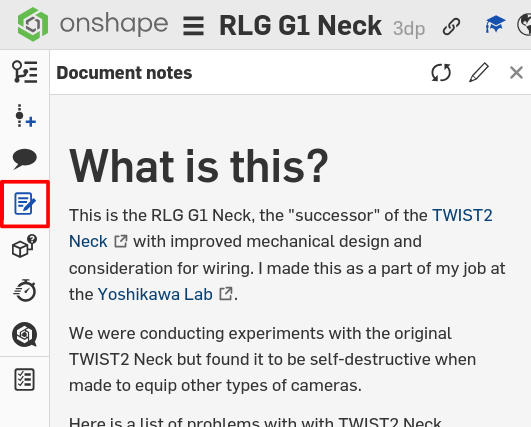
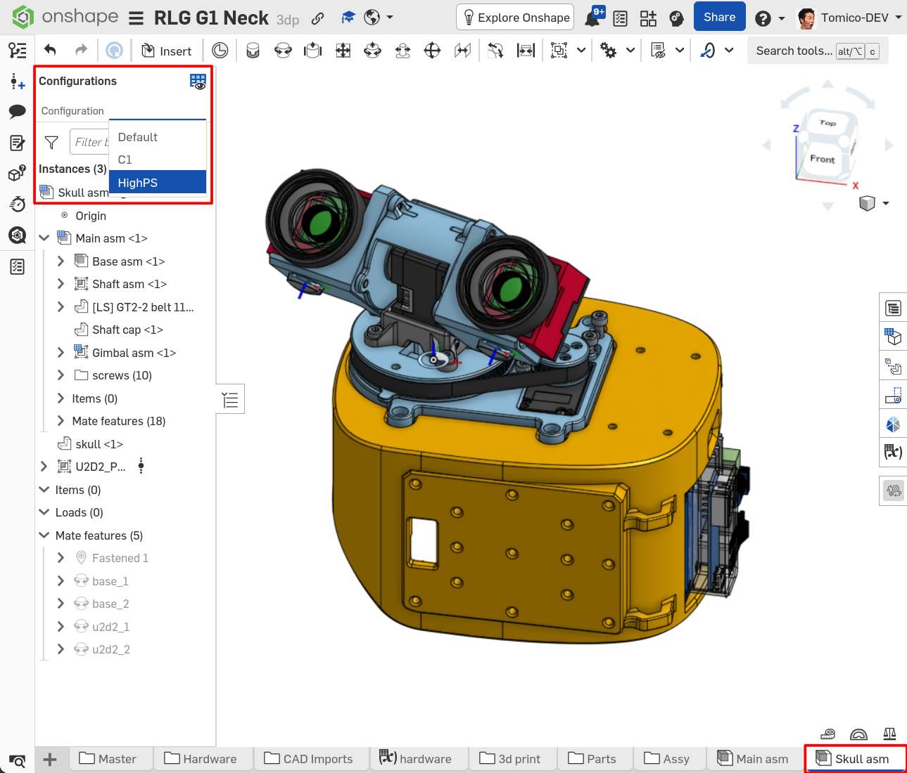

# Hardware
The RLG G1 Neck is mostly 3d-printed and relies on off-the-shelf mechanical components
for smooth and rigid motion. 

Since it was designed in Japan, it mostly uses parts available
in Japan, however sourcing the neccessary parts from alternatives like Aliexpress is not difficult
as it has no preference for specific brands or manufacturers.

Two camera types are currently supported; however it is possible to adapt other camera
types to work as well by creating custom camera mounts.

# BOM
The BOM can be found [here](https://docs.google.com/spreadsheets/d/1gwZNJmtOV1_wQ62z1Mm8VV6fZPQNiGaJnrXC8sGx9LE/edit?usp=sharing).

# CAD
Like the TWIST2 Neck, the RLG G1 Neck was designed in Onshape, and is hosted online. 
It can be found [here](https://cad.onshape.com/documents/614503cf4078ded46dc4d9df/w/728dad7b352bc600fab4452a/e/807a6ef6045ecfcff44e7754?configuration=List_1bw2HqPt7vlDom%3DHighPS&renderMode=0&uiState=6a9431b7f925e2bb1e9022f5).

Design decisions are written in the document notes.

## 3D Printing

To 3D print the parts, you can either navigate to Onshape and export the parts individually, or download
the [premade Bambulab project](https://cad.onshape.com/documents/614503cf4078ded46dc4d9df/w/50a22c666b68854006baa02a/e/ab9fb4c4df483da82351e70b)
also hosted on Onshape. The first method guarantees that the parts will
be the most up to date, while the second is more convenient. 

Printing with dedicated support material interfaces will make the surfaces turn out very nice.
Do this if possible.

## Configurations
There are two configurations for two camera supported types: 
- Accuvision HighPS Mini camera
- Tier IV C1 camera

Switching between configurations is simple; nagivate to the main assembly (`main_asm`)
or the skull assembly (`skull_asm`) and select the configuration you want from the configuration panel.

## Adjusting tolerances to suit your printer and filament
The design makes use of variables and you may adjust parameters to get perfect prints for your specific setup.

You will need to first copy the document, then change the variables in the [hardware variable table](https://cad.onshape.com/documents/614503cf4078ded46dc4d9df/w/728dad7b352bc600fab4452a/e/79a67bc2376c51c3e07317a2?renderMode=0&leftPanel=false&uiState=6a9432c0f925e2bb1e902575).

