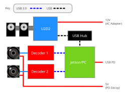

# Wiring
Now that you've assembled your RLG G1 Neck, it is time to hook everything up!

There are only a few things to be noted about how each cable should be connected:

- **C1 Cameras**
    - A usb 3.0 capable hub will probably work for both cameras. Just make sure it has enough bandwidth
- **Accuvision**
    - Hub will probably fail; **Connect directly to Jetson/PC with Superspeed USB capable cables** (the reason for this is still unknown)
    - The cameras need their own 5v supply; you can have them both powered by a PD decoy module
- U2D2: Make sure the micro USB cable actually has data lines (sometimes they don't)
- **Jetson notes**
    - The right usb port on the Jetson AGX Thor devkit (port 5a) is sometimes
      configued as `device`, making peripherals unable to connect (see diagram [here](https://docs.nvidia.com/jetson/agx-thor-devkit/user-guide/latest/hardware_layout.html)) ([more on this](https://forums.developer.nvidia.com/t/jetson-agx-thor-developer-kit-type-c-port-issue/372359)).
      Therefore, **this port should ideally be used for power input only.**
    - **Accuvision**: connect using USB C - A cables to the two USB A ports of the Jetson 