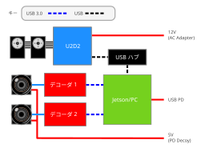

# 配線

各ケーブルの接続方法について、いくつかの重要な注意事項があります：

- **C1カメラ**
    - USB 3.0対応ハブは両方のカメラに対応する可能性があります。十分な帯域幅があることを確認してください
- **Accuvision**
    - ハブは失敗する可能性があります。**Superspeed USB対応ケーブルを使用してJetson/PCに直接接続してください**（この理由はまだ不明です）
    - カメラは独自の5V電源が必要です。PD デコイモジュールで両方に電力を供給できます
- U2D2：マイクロUSBケーブルが実際にデータラインを持っていることを確認してください（持っていない場合も意外とあります）
- **Jetson に関する注意**
    - Jetson AGX Thor devkitの右側のUSBポート（ポート5a）は、`device`として設定される場合があり、周辺機器が接続できなくなります。（こちらの[図](https://docs.nvidia.com/jetson/agx-thor-devkit/user-guide/latest/hardware_layout.html)を参照してください）（[詳細](https://forums.developer.nvidia.com/t/jetson-agx-thor-developer-kit-type-c-port-issue/372359)）
      したがって、**このポートは理想的には電源入力のみに使用する必要があります。**
    - **Accuvision**：USB C - Aケーブルを使用してJetsonの2つのUSB Aポートに接続します
