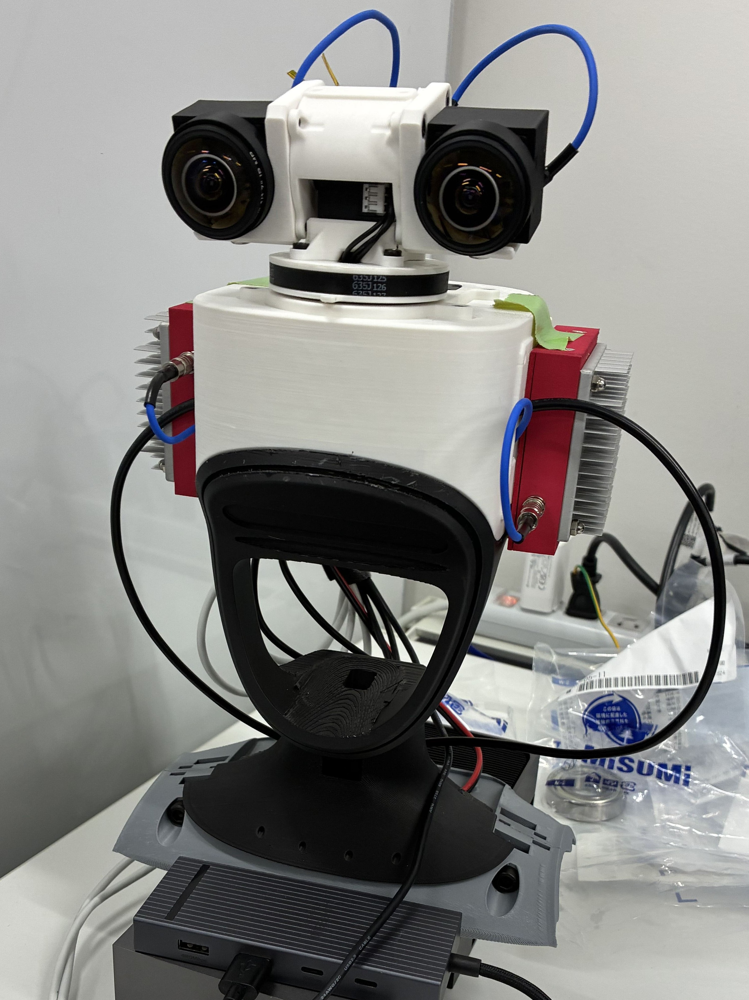

# RLG G1 Neck

This is the documentation for [RLG](http://www.rlg.sys.es.osaka-u.ac.jp/)'s **G1 Neck project**.
The RLG G1 Neck was developed by the [Yoshikawa lab](https://soro.sys.es.osaka-u.ac.jp/en/index.html) 
at [The University of Osaka](https://www.osaka-u.ac.jp/en) and aims to be
the successor of the [TWIST2 Neck](https://yanjieze.com/projects/TWIST2/),
striving to improve upon the TWIST2 Neck namely in terms of mechanical rigidity, cable management,
and extensibility. Like the TWIST2 Neck, the RLG G1 Neck in its default configuration is designed
to be fitted onto the [Unitree G1 humanoid](https://www.unitree.com/g1).

If you have received the develepment kit, please proceed to the [Deployment page](getting-started/deployment.md). 
Otherwise,　follow the Installation guide.

The mechanical details (design decisions, 3d printing instructions, wiring diagram, and assembly guide) may be
found in the Mechanical page. The software details may be found in the Software page.