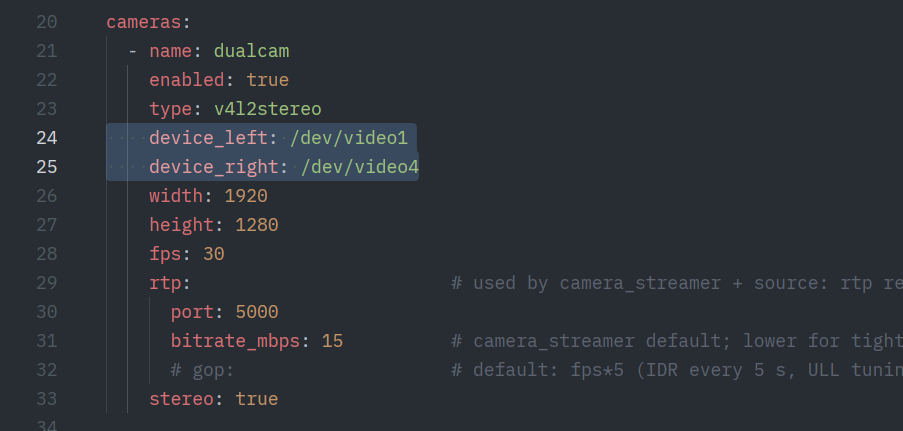
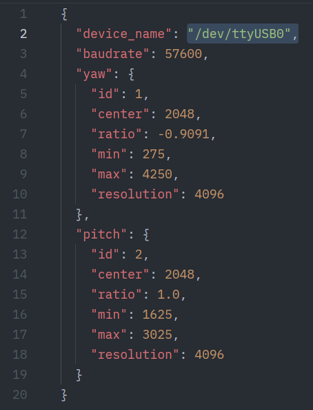

# Troubleshooting

There are a few common issues that may arise when running the teleop
session. Here is a list of the known ones.

## Teleop session not starting despite headset connection
Steps you took:

- You ran the ROS2 launchfile
- You went to the [https://nvidia.github.io/IsaacTeleop/client/main/](https://nvidia.github.io/IsaacTeleop/client/main/) website and hit connect

The effect:

- The browser ui dissappears, but the head tracking does not work and no camera stream is visible
- The controller model is not rendered
- The "show" button is not rendered

Fix:

- Quit the browser client on the headset and try reconnecting. This usually works in one try

## Video feed feels disorienting
There are three possibilities:

- Your left and right camera feeds are swapped
- Your feeds are misaligned
- One of your feeds is not ready

### Swapped camera feeds
Navigate to your workspace folder (`/workspaces/twist2_neck_demo`) then navigate to
the `twist2_neck_ros2` package. Then swap the video feeds in `camera_config.yaml`
```bash
cd /workspaces/twist2_neck_demo  # location might be different depending on your installation
cd src/twist2_neck_ros2
```
```bash
code camera_config.yaml  # or use your preferred code editor
```


You may need to rerun
```bash
colcon build --symlink-install
```
in the workspace root (`~/workspaces/twist2_neck_demo`) and
you will need to restart the G1 Neck stack (<kb>Ctrl</kb>+<kb>c</kb>
then run `ros2 launch` again) (see the [deployment page](getting-started/deployment.md#stoppingrestarting-the-stack) for details).

### Misaligned feeds
See the [camera alignment steps](getting-started/deployment.md#camera-alignment) on how to conduct camera alignment
**(Accuvision only)**

## Feed only on one side
One of the decoders might have not initialized properly (due to USB errors, or cameras being unpowered). Reseat USB connections and ensure that you are NOT using a USB hub for the camera feeds, then   

## Feed works but head is not moving
There are a few possibilities:

- The U2D2 power hub is not turned on
- You are not part of the `dialout` group (this should not be the case if you are using the devkit). 
- The device (port) of the U2D2 is wrong
    - This can be configured through the `config.json` file inside `twist2_neck_ros2`.
      ```bash
      cd /workspaces/twist2_neck_demo  # location might be different depending on your installation
      cd src/twist2_neck_ros2
      ```
      ```bash
      code config.json  # or use your preferred code editor
      ```
      Change the `device_name` field. <br/>
       <br/>
      If you are unsure what your port name is, try
      ```bash
      ls /dev/tty*
      ```
      There will be one that 'stands out', such as `/dev/ttyACM0`. That is probably the U2D2's device.
